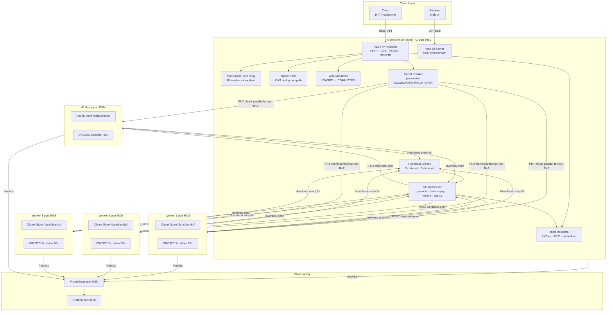

# MiniDFS — System Overview

```mermaid
flowchart TB
  subgraph CL["Client Layer"]
    C["Client\nHTTP consumer"]
    B["Browser\nWeb UI"]
  end

  subgraph CTRL["Controller  port 8080 · UI port 8081"]
    direction LR
    API["REST API Handler\nPOST · GET · PATCH · DELETE"]
    UI["Web UI Server\nSSE event stream"]
    CH["Consistent Hash Ring\n50 vnodes × 4 workers"]
    BF["Bloom Filter\nCAS dedup fast-path"]
    MD["bbolt Metadata\nB+Tree · ACID · embedded"]
    WAL["WAL Manifests\nSTAGED → COMMITTED"]
    HL["Heartbeat Leases\n2s interval · 6s timeout"]
    CB["Circuit Breaker\nper-worker CLOSED/OPEN/HALF_OPEN"]
    GC["GC Reconciler\nperiodic · stale expiry · restore · top-up"]
    API --> CH
    API --> BF
    API --> MD
    API --> WAL
    API --> CB
    HL --> GC
    GC --> MD
  end

  subgraph OBS["Observability"]
    PROM["Prometheus  port 9090"]
    GRAF["Grafana  port 3000"]
    PROM --> GRAF
  end

  subgraph W1["Worker 1  port 8001"]
    S1["Chunk Store /data/chunks/"]
    SC1["CRC32C Scrubber 30s"]
  end
  subgraph W2["Worker 2  port 8002"]
    S2["Chunk Store /data/chunks/"]
    SC2["CRC32C Scrubber 30s"]
  end
  subgraph W3["Worker 3  port 8003"]
    S3["Chunk Store /data/chunks/"]
    SC3["CRC32C Scrubber 30s"]
  end
  subgraph W4["Worker 4  port 8004"]
    S4["Chunk Store /data/chunks/"]
    SC4["CRC32C Scrubber 30s"]
  end

  C -->|"REST API"| API
  B -->|"UI + SSE"| UI
  CB -->|"PUT chunk parallel fan-out R=2"| W1 & W2 & W3 & W4
  GC -->|"POST /replicate-peer"| W1 & W2 & W3 & W4
  W1 & W2 & W3 & W4 -->|"Heartbeat every 2s"| HL
  W1 & W2 & W3 & W4 -->|"inventory scan"| GC
  CTRL -->|"/metrics"| PROM
  W1 & W2 & W3 & W4 -->|"/metrics"| PROM
```
