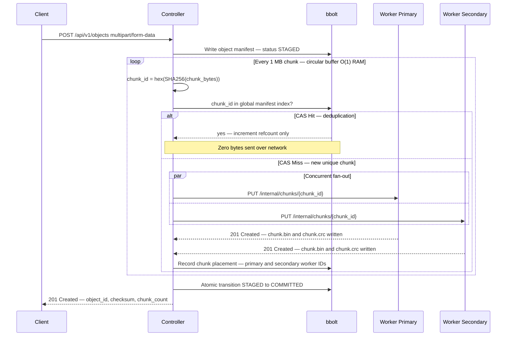

# MiniDFS — Upload Flow (Two-Phase Commit + CAS Deduplication)

```mermaid
sequenceDiagram
  participant C as Client
  participant CTL as Controller
  participant DB as bbolt
  participant WP as Worker Primary
  participant WS as Worker Secondary

  C->>CTL: POST /api/v1/objects multipart/form-data
  CTL->>DB: Write object manifest — status STAGED

  loop Every 1 MB chunk — circular buffer O(1) RAM
    CTL->>CTL: chunk_id = hex(SHA256(chunk_bytes))
    CTL->>DB: chunk_id in global manifest index?

    alt CAS Hit — deduplication
      DB-->>CTL: yes — increment refcount only
      Note over CTL,DB: Zero bytes sent over network
    else CAS Miss — new unique chunk
      par Concurrent fan-out
        CTL->>WP: PUT /internal/chunks/{chunk_id}
      and
        CTL->>WS: PUT /internal/chunks/{chunk_id}
      end
      WP-->>CTL: 201 Created — chunk.bin and chunk.crc written
      WS-->>CTL: 201 Created — chunk.bin and chunk.crc written
      CTL->>DB: Record chunk placement — primary and secondary worker IDs
    end
  end

  CTL->>DB: Atomic transition STAGED to COMMITTED
  CTL-->>C: 201 Created — object_id, checksum, chunk_count
```
