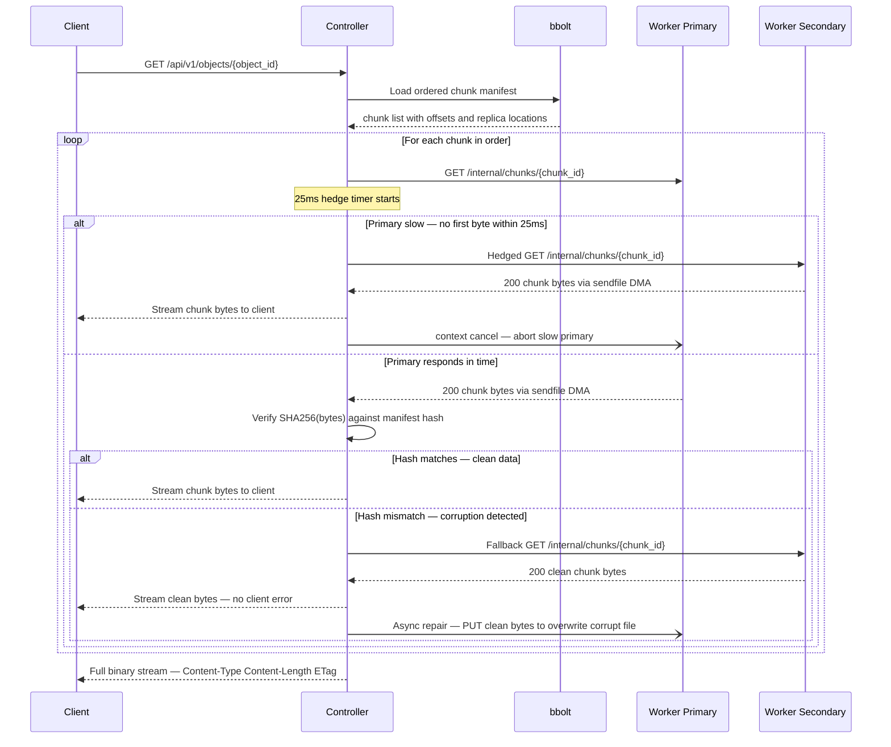

# MiniDFS — Download Flow (Hedged Reads + Read-Repair)

```mermaid
sequenceDiagram
  participant C as Client
  participant CTL as Controller
  participant DB as bbolt
  participant WP as Worker Primary
  participant WS as Worker Secondary

  C->>CTL: GET /api/v1/objects/{object_id}
  CTL->>DB: Load ordered chunk manifest
  DB-->>CTL: chunk list with offsets and replica locations

  loop For each chunk in order
    CTL->>WP: GET /internal/chunks/{chunk_id}
    Note over CTL: 25ms hedge timer starts

    alt Primary slow — no first byte within 25ms
      CTL->>WS: Hedged GET /internal/chunks/{chunk_id}
      WS-->>CTL: 200 chunk bytes via sendfile DMA
      CTL-->>C: Stream chunk bytes to client
      CTL-)WP: context cancel — abort slow primary

    else Primary responds in time
      WP-->>CTL: 200 chunk bytes via sendfile DMA
      CTL->>CTL: Verify SHA256(bytes) against manifest hash

      alt Hash matches — clean data
        CTL-->>C: Stream chunk bytes to client
      else Hash mismatch — corruption detected
        CTL->>WS: Fallback GET /internal/chunks/{chunk_id}
        WS-->>CTL: 200 clean chunk bytes
        CTL-->>C: Stream clean bytes — no client error
        CTL-)WP: Async repair — PUT clean bytes to overwrite corrupt file
      end
    end
  end

  CTL-->>C: Full binary stream — Content-Type Content-Length ETag
```
