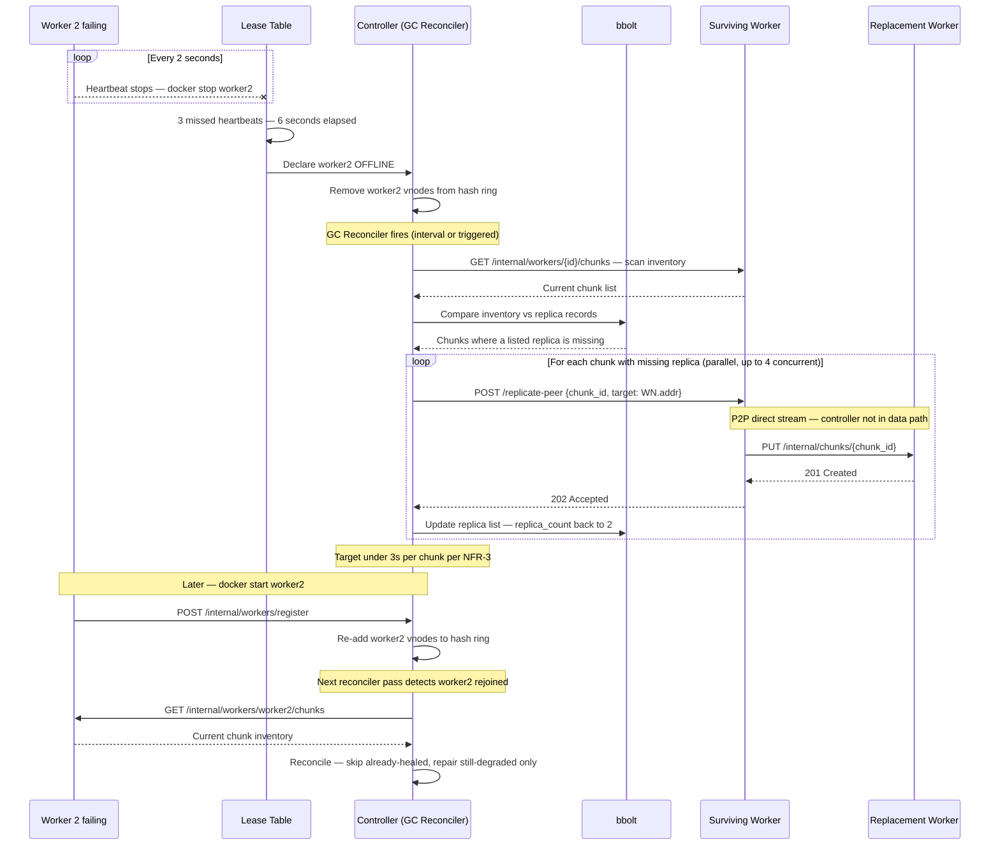

# MiniDFS — Self-Healing (P2P Replication + GC Reconciler)

```mermaid
sequenceDiagram
  participant W2 as Worker 2 failing
  participant LT as Lease Table
  participant CTL as Controller (GC Reconciler)
  participant DB as bbolt
  participant WS as Surviving Worker
  participant WN as Replacement Worker

  loop Every 2 seconds
    W2--xLT: Heartbeat stops — docker stop worker2
  end

  LT->>LT: 3 missed heartbeats — 6 seconds elapsed
  LT->>CTL: Declare worker2 OFFLINE
  CTL->>CTL: Remove worker2 vnodes from hash ring

  Note over CTL: GC Reconciler fires (interval or triggered)
  CTL->>WS: GET /internal/workers/{id}/chunks — scan inventory
  WS-->>CTL: Current chunk list
  CTL->>DB: Compare inventory vs replica records
  DB-->>CTL: Chunks where a listed replica is missing

  loop For each chunk with missing replica (parallel, up to 4 concurrent)
    CTL->>WS: POST /replicate-peer {chunk_id, target: WN.addr}
    Note over WS,WN: P2P direct stream — controller not in data path
    WS->>WN: PUT /internal/chunks/{chunk_id}
    WN-->>WS: 201 Created
    WS-->>CTL: 202 Accepted
    CTL->>DB: Update replica list — replica_count back to 2
  end

  Note over CTL: Target under 3s per chunk per NFR-3

  Note over W2,CTL: Later — docker start worker2
  W2->>CTL: POST /internal/workers/register
  CTL->>CTL: Re-add worker2 vnodes to hash ring
  Note over CTL: Next reconciler pass detects worker2 rejoined
  CTL->>W2: GET /internal/workers/worker2/chunks
  W2-->>CTL: Current chunk inventory
  CTL->>CTL: Reconcile — skip already-healed, repair still-degraded only
```
