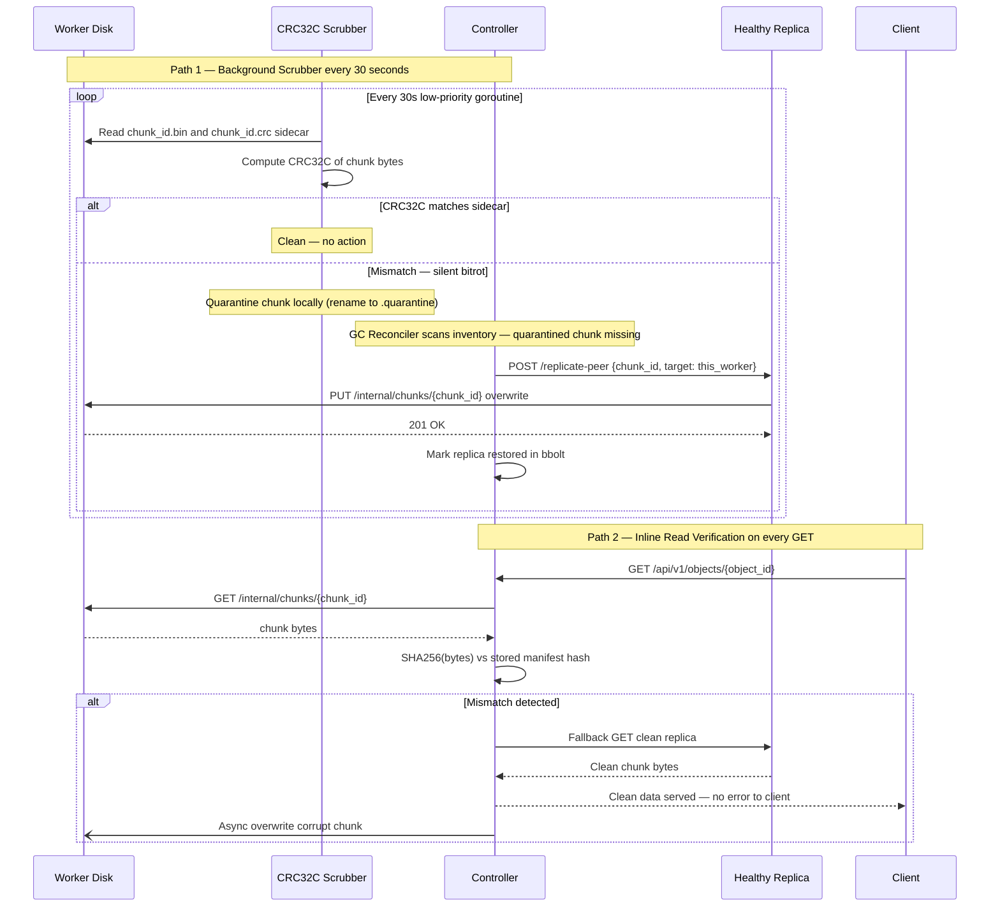

# MiniDFS — Data Integrity (CRC32C Scrubber + SHA-256 Inline Verification)

```mermaid
sequenceDiagram
  participant DISK as Worker Disk
  participant SCRUB as CRC32C Scrubber
  participant CTL as Controller
  participant WS as Healthy Replica
  participant C as Client

  Note over DISK,CTL: Path 1 — Background Scrubber every 30 seconds
  loop Every 30s low-priority goroutine
    SCRUB->>DISK: Read chunk_id.bin and chunk_id.crc sidecar
    SCRUB->>SCRUB: Compute CRC32C of chunk bytes
    alt CRC32C matches sidecar
      Note over SCRUB: Clean — no action
    else Mismatch — silent bitrot
      Note over SCRUB: Quarantine chunk locally (rename to .quarantine)
      Note over CTL: GC Reconciler scans inventory — quarantined chunk missing
      CTL->>WS: POST /replicate-peer {chunk_id, target: this_worker}
      WS->>DISK: PUT /internal/chunks/{chunk_id} overwrite
      DISK-->>WS: 201 OK
      CTL->>CTL: Mark replica restored in bbolt
    end
  end

  Note over C,CTL: Path 2 — Inline Read Verification on every GET
  C->>CTL: GET /api/v1/objects/{object_id}
  CTL->>DISK: GET /internal/chunks/{chunk_id}
  DISK-->>CTL: chunk bytes
  CTL->>CTL: SHA256(bytes) vs stored manifest hash
  alt Mismatch detected
    CTL->>WS: Fallback GET clean replica
    WS-->>CTL: Clean chunk bytes
    CTL-->>C: Clean data served — no error to client
    CTL-)DISK: Async overwrite corrupt chunk
  end
```
