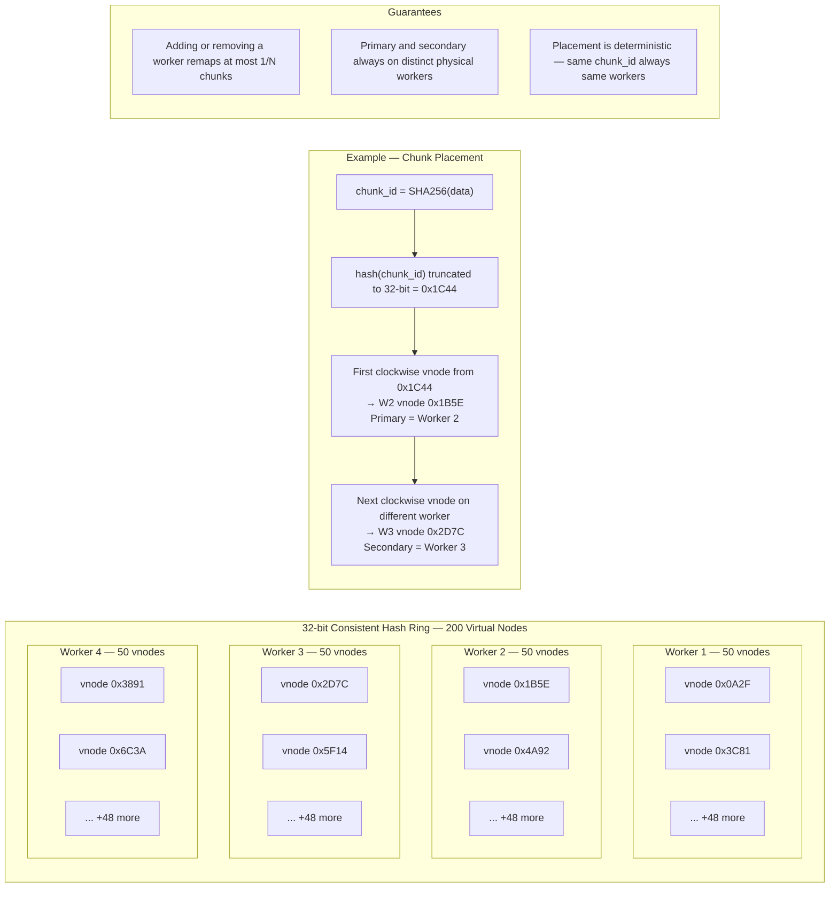

# MiniDFS — Consistent Hash Ring (200 Virtual Nodes)

```mermaid
flowchart LR
  subgraph RING["32-bit Consistent Hash Ring — 200 Virtual Nodes"]
    direction TB
    subgraph W1N["Worker 1 — 50 vnodes"]
      V1A["vnode 0x0A2F"]
      V1B["vnode 0x3C81"]
      V1C["... +48 more"]
    end
    subgraph W2N["Worker 2 — 50 vnodes"]
      V2A["vnode 0x1B5E"]
      V2B["vnode 0x4A92"]
      V2C["... +48 more"]
    end
    subgraph W3N["Worker 3 — 50 vnodes"]
      V3A["vnode 0x2D7C"]
      V3B["vnode 0x5F14"]
      V3C["... +48 more"]
    end
    subgraph W4N["Worker 4 — 50 vnodes"]
      V4A["vnode 0x3891"]
      V4B["vnode 0x6C3A"]
      V4C["... +48 more"]
    end
  end

  subgraph PLACE["Example — Chunk Placement"]
    CHUNK["chunk_id = SHA256(data)"]
    HASH["hash(chunk_id) truncated to 32-bit = 0x1C44"]
    PRIMARY["First clockwise vnode from 0x1C44\n→ W2 vnode 0x1B5E\nPrimary = Worker 2"]
    SECONDARY["Next clockwise vnode on different worker\n→ W3 vnode 0x2D7C\nSecondary = Worker 3"]
    CHUNK --> HASH --> PRIMARY --> SECONDARY
  end

  subgraph PROPS["Guarantees"]
    P1["Adding or removing a worker remaps at most 1/N chunks"]
    P2["Primary and secondary always on distinct physical workers"]
    P3["Placement is deterministic — same chunk_id always same workers"]
  end
```
